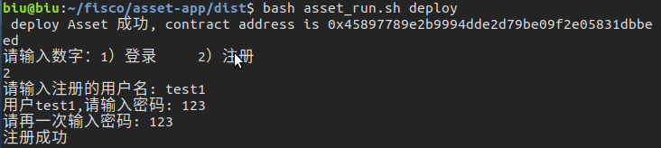
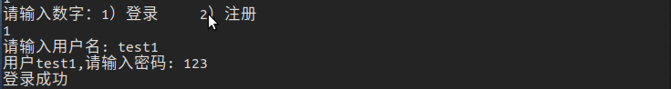
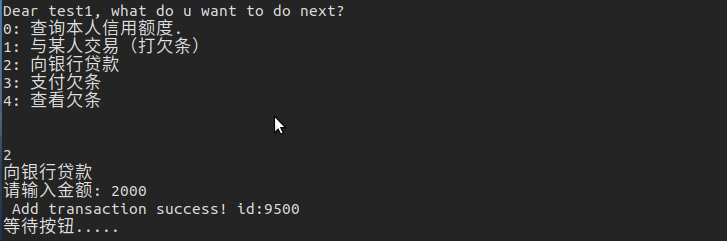
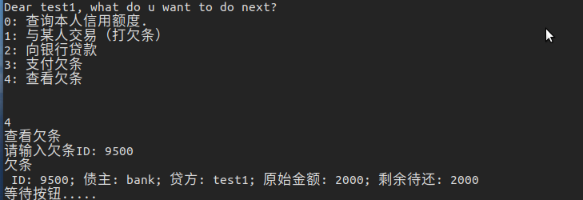
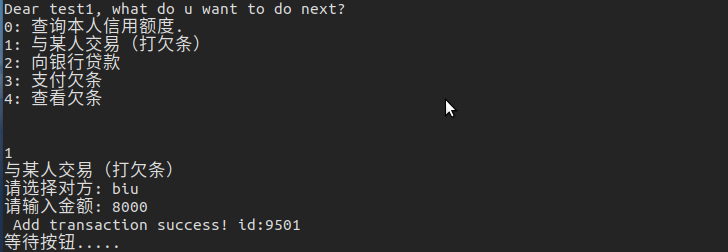
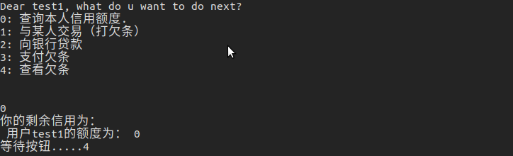
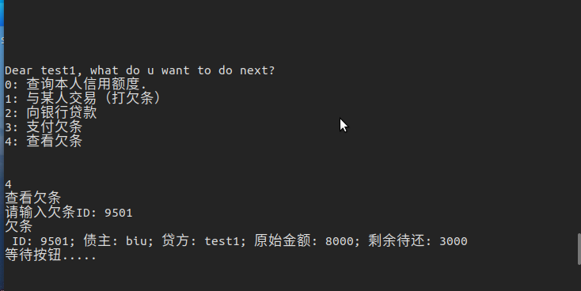

# 区块链实验项目

| 学号     | 姓名   | 分工                                                         |
| -------- | ------ | ------------------------------------------------------------ |
| 18340018 | 陈思元 | 完成智能合约中额度转移部分，以及相应报告编写                 |
| 18340020 | 陈贤彪 | 完成智能合约中账户注册以及用户交互的代码实现，以及相应报告编写 |
| 18340025 | 陈志强 | 完成智能合约中欠条生成与支付欠条部分，以及相应报告编写       |

[toc]

## 一、项目介绍

#### 1、项目名称

​		基于区块链、智能合约等，实现基于区块链的供应链金融平台。

#### 2、项目介绍

**2.1传统供应链金融的问题**

**（1）供应商的平均应收账款账期长** 

​		核心企业因其实力雄厚在议价中总是属于优势地位，与上游供应商的采购交易往往采用赊销的方式，应收账款账龄一般为3-6 个月。作为供应商的中小企业一方面要接受核心企业几个月账龄的应收（否则核心企业另寻其他中小企业合作将其替代），另一方面要承担赊销情况向上游供应商采购的资金压力。

**（2）传统线下业务效率低** 

​		从核心企业的角度。应收账款融资是需要核心企业向银行确权才能实现，实践中，核心企业并不能从供应商融资中获得收益，缺乏确权动力，且核心企业对应收账款确权需要层层流程审批，占用人力物力等成本。从银行的角度。一方面，授信成本高。银行对供应商的材料、合同盖章的真伪性等审核需要经过多种审核，流程繁琐，操作风险高，且当核心企业和供应商在不同的地区时，银行还要外派人力在全国各地进行审查，操作成本高。另一方面，再流转困难。银行 A 向供应商发放贷款后，当银行 A 将整个资产转让给银行 B，线下业务操作中，每笔贷款小而多，银行 B 基于道德风险考虑也要涉及线下对贸易背景真实性、合同真实性、发票真实性的审查，这无疑增加增加银行 A 将整个资产转让出去的难度。

**（3）核心企业难以实现信用穿透** 

​		我国应收账款规模庞大，根据万向平台统计数据，仅工业一年的应收账款就高达几十万亿元。一方面，核心企业有挖掘其自身信用价值的需求，当往往因企业缺乏专项类人才以及市场缺乏标准化工具而受到局限。另一方面，以核心企业的信用为杠杆衍生而出的授信仅能覆盖其两端直接相关的供应商，且二级上下游中小企业与核心企业往往没有直接购销合同，而因而二级或者二级以上的供销商的融资难题仍然难以解决。以应收账款融资为例，核心企业以银行票据等商票作为支付，一级供应商和二级供应商的交易额度往往比与核心企业的交易金额低，但由于商票不能拆分，二级供应商从则无法利用该银行票据向银行申请贷款，核心企业信用仅能传至一级供应商。

**（4）企业彼此间为信息孤岛** 

​		供应链各个参与主体普通使用单独的 ERP 系统，信息在整个供应链上散点式分布，例如货物信息存储于供应商的仓储系统，发货信息存储于物流公司系统，资金信息存储于银行系统，信息流信息存储于核心企业业务系统。且供应链金融各个市场参与主体彼此处于信息孤岛状态，信息不透明且难以实时或者及时交互，每个参与方只能了解企业自身发生的交易信息，难以实时了解到其他环节的相关信息或者只能事后了解。近年来，我国不乏一些以虚构贸易或者重复抵押质押等多种形态的欺诈方式获取银行资金。

**（5）贸易背景真实性难以验证** 

​		结合前文第四点企业彼此间为信息的孤岛的分析，由于供应链金融的市场产于主体只能实时准确掌握自己管理的信息。企业处于对自身商业信息的保护，会增设防截取防篡改技术或者采用授权访问等多中线上线下方式保护自身企业数据，造成其他企业或者银行在收集数据信息时付出高昂的成本，或者等即使收集到其他参与者的数据也很难进行验证真伪，或者由于数据的庞杂需要付出高昂的收集和核实成本，贸易真实性验证成本高，实践中，我国近年来不乏以虚构贸易、重复抵押质押等多种形态欺诈方式。

**2.2区块链技术的供应链金融解决方案**

**（1）分布式记账技术打破企业间信息孤岛问题** 

​		通过区块链分布式账本技术在供应链参与方间建立可信的信息共享平台，各参与方在分布式共享账本上的各个节点完成记账并共享各类信息。每一个主体的信息都公开透明，每个节点都保存完整账本信息，打破了企业各自为政的数据信息孤岛困境，信息流在整个供应链流通，共享一个账本的各个参与方都能及时获取交易对手等其他企业的信息。

**（2）可追溯性解决贸易背景真实性问题** 

​		区块链技术的可追溯性降低企业数据造假的动机。虽然从技术上不能保证数据来源真实可靠，但是区块链技术的可追溯性能够对整个交易进行追溯，进而识别是哪个环节哪个企业的数据造假，降低企业数据造假的可能性，从而最大可能的保证交易信息真实性。

**（3）可拆分数字票据解决核心企业信用跨级传递难题** 

​		金融机构与核心企业及供应链上的供应商通过共享一个分布式账本，利用区块链技术发行的数字票据在共享链上进行任意的拆分和转移，解决了商票不能拆分，核心企业信用难以跨级传递的问题。

#### 3、项目功能

​		功能一：实现采购商品—签发应收账款交易上链。

​		功能二：实现应收账款的转让上链，上游企业可将应收账款单据转让给下游企业抵债，下游企业可凭借上游企业转让的应收账款单据融资或向要求单据偿债方企业偿债。

​		功能三：利用应收账款向银行融资上链，供应链上所有可以利用应收账款单据向银行申请融资。

​		功能四：应收账款支付结算上链，应收账款单据到期时核心企业向下游企业支付相应的欠款。

## 二、方案设计

#### 1、区块链+供应链金融方案内容设计

**1.1区块链+供应链金融方案核心技术**

**（1）分布式账本技术** 

​		分布式账本技术可以实现位于不同物理地址的企业通过分占账本各个节点实现线上管理自身数据并进行数据分享。分占节点的企业拥有管理自身数据的独立性，同时能够被授权访问其他节点数据，各节点之间权限等同相互独立且互不干涉。

**（2）共识算法技术** 

​		即实现各个节点事务的先后顺序保持一致的算法。

**（3）智能合约技术** 

​		即以代码定义及强制实行的计算机合约技术。

**（4）密码学技术** 

​		包括哈希算法、数字签名及数字证书、对称与非对称加密技术、同态加密及零知识证明等。

**1.2区块链+供应链金融方案拟解决问题的流程**

​		基于区块链技术的供应链金融具体流程（以应收账款为例）如下图1：

​		首先，核心和供应商签订合同，核心企业确认收货后供应商向其开具发票，两者交易完成，核心企业对供应商产生应付账款；

​		第二步，一级供应商根据融资需求，向区块链供应链金融平台上传贸易交易合同、发票等信息；

​		第三步，核心企业在平台确认应收账款；

​		第四步，供应商授权银行查看相关文件存证，银行审核无误后根据贸易合同应收账款金额，向核心企业发放应收账款形成的数字凭证（token，即代币）；

​		第五步，核心企业收到该数字资产也即该代币后，将这代币结算给一级供应商；

​		第六步，一级供应商将数字资产向银行申请融资或者拆分用于结算对二级供应商的应收等债务；

​		第七步，由于该数字资产对应的应收账款还未到期，一级供应商或者二—N级供应商向银行融资时，类似票据贴现，银行扣掉相应的手续费后给供应商发放现金贷款；

​		最后，应收账款到期，核心企业还款，区块链供应链金融平台利用其智能合约技术自动执行，根据一级供应商、二—N级供应商以及银行账上的数字凭证对应的金额进行还款。由于是到期给付，供应商和银行在平台上将数字凭证兑换成现金时并不需要类似票据贴现那边扣除手续费。


​		综上，基于区块链技术的供应链金融业务操作，主要体现在利用区块链技术将应收账款凭证等资产生成等值的数字化资产，实现资产数字化并在整个供应链金融上进行拆分转让。传统的供应链金融，以应收账款为例，核心企业对其上下游供销商的赊销活动，产生了核心企业对供销商的应付账款，在实践操作中，核心企业一般以商业汇票偿付对其对供销商的应付账款，但根据票据法，纸质版的商业汇票不能部分背书转让，核心企业的一级供销商在核心企业处获得的商业汇票不能拆分给二级及以上的供销商，再加上核心企业二级及以上的供销商和核心企业又没有直接的购销合同，所以在目前的供应链金融实践业务中，核心企业的信用不能传递到二级及以上的供销商，这些二级及以上供销商的中小企业仍是不能借用核心企业的信用在供应链金融业务中获得资金支持。

​		基于区块链技术的供应链金融，利用区块链技术，将核心企业对供应商开出的商业汇票生成了可拆分可转让的数字资产，以应收账款融资为例，在区块链技术的支持下，将该商业汇票生成了等值的数字资产，也即 COU，即应收账款的数字凭证。一级供销商在核心企业获得 COU，不妨设为价值 100 万元的 COU，一级和二级供销商之间的交易合同价值为 80 万元，那么一级供销商就可以将该100 万的 COU 拆分出 80 万，用于结算其对二级供销商的交易账款。无论 COU被如何拆分转让，都可以追溯到该 COU 是核心企业对一级供销商的商业汇票，出票人对应着核心企业，从而实现了核心企业信用在整个供应链的各个供销商的跨级传递。

**1.3方案具体内容**

（1）智能合约设计

（2）链端合约部署

（3）后端以及API接口设计

（4）前端界面设计

#### 2、智能合约具体内容设计

多个账户组成系统，每个账户为一个对象，对象分为银行账户和普通账户，银行账户仅有1个。

**用户能使用的功能函数**

账户注册：普通公司用不同的公司名称向银行注册，获取初始资金。

账户间转账（向其他公司借钱）：普通公司间的资金流通。

信息查询：仅查看本公司信用额度。

账单查询：仅查看本公司的账单信息。

账单转移：仅转移债权人落款为本公司的账单。

偿还欠条：仅偿还欠款人落款为本公司的账单。

申请融资（向银行借钱）：仅使用欠款人落款为本公司的账单向银行申请融资。

## 三、智能合约实现

#### 1.事件

​		这里我们一共设置了4个函数，分别是账户注册、账户额度转移、转移添加和转移更新，每个事件的定义如下：

```java
event RegisterEvent(int256 ret, string account, int256 asset_value);
event TransferEvent(int256 ret, string from_account, string to_account, int256 amount);
event AddTransactionEvent(int256 ret, string id, string acc1, string acc2, int256 money);
event UpdateTransactionEvent(int256 ret, string id, int256 money);
```

#### 2.基础函数

​		首先是创建表，这里我们用到了构造函数

```java
constructor() public {
        // 构造函数中创建t_asset表
        createTable();
    }

    function createTable() private {
        TableFactory tf = TableFactory(0x1001);
        // 创建表
        tf.createTable("t_asset", "account", "asset_value");
        // 交易记录表, key: id, field: acc1, acc2, money, status
        tf.createTable("t_transaction", "id","acc1, acc2, money, status");
    }
```

​		然后是返回t_asset

```java
function openAssetTable() private returns(Table) {
        TableFactory tf = TableFactory(0x1001);
        Table table = tf.openTable("t_asset");
        return table;
    }
```

​		返回t_transaction

```java
function openTransactionTable() private returns(Table) {
        TableFactory tf = TableFactory(0x1001);
        Table table = tf.openTable("t_transaction");
        return table;
    }
```

#### 3.功能函数

​		查询信用金额，这个操作我们通过account : 资产账户来对用户的信用金额做一个查询。

```java
function select(string account) public constant returns(int256, int256) {
        // 打开表
        Table table = openAssetTable();
        // 查询
        Entries entries = table.select(account, table.newCondition());
        int256 asset_value = 0;
        if (0 == uint256(entries.size())) {
            return (-1, asset_value);
        } else {
            Entry entry = entries.get(0);
            return (0, int256(entry.getInt("asset_value")));
        }
    }
```

​		查询欠条信息，这个操作我们插叙弄了用户的欠条信息，通过id : 欠条id号来实现查询。

```java
function select_transaction(string id) public constant returns(int256[], bytes32[]) {
        // 打开表
        Table table = openTransactionTable();
        // 查询
        Entries entries = table.select(id, table.newCondition());
        //         bytes32[] memory str_list = new bytes32[](2);

        int256[] memory int_list = new int256[](3);   //ret_code, money, status
        bytes32[] memory str_list = new bytes32[](2);   //acc1, acc2
        if (0 == uint256(entries.size())) {
            int_list[0] = -1;
            return (int_list, str_list);
        } else {
            Entry entry = entries.get(0);
            int_list[1] = entry.getInt("money");
            int_list[2] = entry.getInt("status");
            str_list[0] = entry.getBytes32("acc1");
            str_list[1] = entry.getBytes32("acc2");
            return (int_list, str_list);
        }
    }
```

​		注册账户，这个操作是让我们创建一个新的用户，我们使用 account : 账户名、amount : 额度来实现对用户的创建。

```java
function register(string account, int256 asset_value) public returns(int256){
        int256 ret_code = 0;
        int256 ret = 0;
        int256 temp_asset_value = 0;
        // 查询账户是否存在

        (ret, temp_asset_value) = select(account);
        if(ret != 0) {
            Table table = openAssetTable();
            
            Entry entry = table.newEntry();
            entry.set("account", account);
            entry.set("asset_value", int256(asset_value));
            // 插入
            int count = table.insert(account, entry);
            if (count == 1) {
                // 成功
                ret_code = 0;
            } else {
                // 失败? 无权限或者其他错误
                ret_code = -2;
            }
        } else {
            // 账户已存在
            ret_code = -1;
        }

        emit RegisterEvent(ret_code, account, asset_value);

        return ret_code;
    }
```

​		借钱（打欠条）功能的实现，记录一个账户向另一个账户接了多少钱，这样就能实现打欠条的功能了，我们使用id : 欠条号、zhaizhu : 债主、account2 : 借债人、money: 金额来作参数，以实现上述的功能。

```java
function addTransaction(string id, string zhaizhu, string account2, int256 money) public returns(int256){
        int256 ret_code = 0;
        int256 ret = 0;
        bytes32[] memory str_list = new bytes32[](2);
        int256[] memory int_list = new int256[](3);
        
        // 查询交易是否存在
        (int_list, str_list) = select_transaction(id);
        if(int_list[0] != int256(0)) {
            Table table = openTransactionTable();

            Entry entry0 = table.newEntry();
            entry0.set("id", id);
            entry0.set("acc1", zhaizhu);
            entry0.set("acc2", account2);
            entry0.set("money", int256(money));
            entry0.set("status", int256(money));
            // 插入
            int count = table.insert(id, entry0);
            if (count == 1) {
                // 将欠款人的信用额度转移一部分给债主
                ret = transfer(account2,zhaizhu,money);
                // 信用额度转让失败
                if(ret != 0) {
                    ret_code = -3;
                } else {
                    ret_code = 0;
                }
            } else {
                // 失败? 无权限或者其他错误
                ret_code = -2;
            }
        } else {
            // 交易ID已存在
            ret_code = -1;
        }

        emit AddTransactionEvent(ret_code, id, zhaizhu, account2, money);

        return ret_code;
    }

```

​		支付欠条，说白了就是还钱的操作，我们使用的参数是id : 欠条号码、money: 金额

```java
function updateTransaction(string id, int256 money) public returns(int256, string[]){
        int256 ret_code = 0;
        // int256 ret = 0;
        bytes32[] memory str_list = new bytes32[](2);
        int256[] memory int_list = new int256[](3);
        string[] memory acc_list = new string[](2);
        // 查询该欠条是否存在
        (int_list, str_list) = select_transaction(id);
        acc_list[0] = byte32ToString(str_list[0]);
        acc_list[1] = byte32ToString(str_list[1]);

        if(int_list[0] == 0) { // 交易ID存在

            // 当还的钱大于应还钱数目的时候，返回-2
            if(int_list[2] < money){
                ret_code = -2;
                emit UpdateTransactionEvent(ret_code, id, money);
                return (ret_code, acc_list);
            }

            // 更新交易状态
            Table table = openTransactionTable();

            Entry entry0 = table.newEntry();
            entry0.set("id", id);
            entry0.set("acc1", byte32ToString(str_list[0]));
            entry0.set("acc2", byte32ToString(str_list[1]));
            entry0.set("money", int_list[1]);
            entry0.set("status", (int_list[2] - money));

            // 更新欠条
            int count = table.update(id, entry0, table.newCondition());
            if(count != 1) {
                ret_code = -3;
                // 失败? 无权限或者其他错误?
                emit UpdateTransactionEvent(ret_code, id, money);
                return (ret_code,acc_list);
            }

            // 信用额度返还
            //由于还钱之后，还债人的额度能够增加
            int256 temp = transfer(byte32ToString(str_list[0]),byte32ToString(str_list[1]),money);
            if(temp != 0){
                ret_code = -4 * 10 + temp;
                emit UpdateTransactionEvent(ret_code, id, money);
                return (ret_code,acc_list);
            }

            ret_code = 0;
      
        } else { // 交易ID不存在
            ret_code = -1;
        }
        emit UpdateTransactionEvent(ret_code, id, money);

        return (ret_code,acc_list);
    }
```

​			最后一个功能就是所信用额度转移，我们需要输入的参数有from_account : 转移资产账户、to_account ： 接收资产账户、amount ： 转移金额

```java
function transfer(string from_account, string to_account, int256 amount) public returns(int256) {
        // 查询转移资产账户信息
        int ret_code = 0;
        int256 ret = 0;
        int256 from_asset_value = 0;
        int256 to_asset_value = 0;
        
        // 查询from_account是否合法
        (ret, from_asset_value) = select(from_account);
        if(ret != 0) {
            ret_code = -1;
            // 转移账户不存在
            emit TransferEvent(ret_code, from_account, to_account, amount);
            return ret_code;

        }

        // 查询to_account是否合法
        (ret, to_asset_value) = select(to_account);
        if(ret != 0) {
            ret_code = -2;
            // 接收资产的账户不存在
            emit TransferEvent(ret_code, from_account, to_account, amount);
            return ret_code;
        }

        if(from_asset_value < amount) {
            ret_code = -3;
            // 当from_account的额度不足，则返回-3
            emit TransferEvent(ret_code, from_account, to_account, amount);
            return ret_code;
        } 


        Table table = openAssetTable();

        Entry entry0 = table.newEntry();
        entry0.set("account", from_account);
        entry0.set("asset_value", int256(from_asset_value - amount));
        // 更新from_account的额度
        int count = table.update(from_account, entry0, table.newCondition());
        if(count != 1) {
            ret_code = -5;
            // 失败? 无权限或者其他错误?
            emit TransferEvent(ret_code, from_account, to_account, amount);
            return ret_code;
        }

        Entry entry1 = table.newEntry();
        entry1.set("account", to_account);
        entry1.set("asset_value", int256(to_asset_value + amount));
        // 更新to_account的额度
        table.update(to_account, entry1, table.newCondition());

        emit TransferEvent(ret_code, from_account, to_account, amount);

        return ret_code;
    }
```

## 四、后端设计

​		在后端实现的部分，我们主要采用了JAVASDK与链端进行交互，并且同时使用JAVA提供的httpServer包处理http请求。

- javasdk的初始化如下：


```java
public void initialize() throws Exception {
    @SuppressWarnings("resource")
    ApplicationContext context =
        new ClassPathXmlApplicationContext("classpath:applicationContext.xml");
    bcosSDK = context.getBean(BcosSDK.class);
    client = bcosSDK.getClient(1);
    cryptoKeyPair = client.getCryptoSuite().createKeyPair();
    client.getCryptoSuite().setCryptoKeyPair(cryptoKeyPair);
    logger.debug("create client for group1, account address is " + cryptoKeyPair.getAddress());
  }
```

- 返回的操作如下：


```java
public void deployAssetAndRecordAddr() {

    try {
      Asset asset = Asset.deploy(client, cryptoKeyPair);
      System.out.println(
          " deploy Asset 成功, contract address is " + asset.getContractAddress());

      recordAssetAddr(asset.getContractAddress());
    } catch (Exception e) {
      // TODO Auto-generated catch block
      // e.printStackTrace();
      System.out.println(" deploy Asset contract failed, error message is  " + e.getMessage());
    }
  }
```

​		加载地址和建立连接的操作如下：

```java
public void recordAssetAddr(String address) throws FileNotFoundException, IOException {
    Properties prop = new Properties();
    prop.setProperty("address", address);
    final Resource contractResource = new ClassPathResource("contract.properties");
    FileOutputStream fileOutputStream = new FileOutputStream(contractResource.getFile());
    prop.store(fileOutputStream, "contract address");
  }

  public String loadAssetAddr() throws Exception {
    // load Asset contact address from contract.properties
    Properties prop = new Properties();
    final Resource contractResource = new ClassPathResource("contract.properties");
    prop.load(contractResource.getInputStream());

    String contractAddress = prop.getProperty("address");
    if (contractAddress == null || contractAddress.trim().equals("")) {
      throw new Exception(" load Asset contract address failed, please deploy it first. ");
    }
    logger.info(" load Asset address from contract.properties, address is {}", contractAddress);
    return contractAddress;
  }
```

- 判断账户是否存在


```java
public boolean queryAssetAmount(String assetAccount) {
    try {
      String contractAddress = loadAssetAddr();
      Asset asset = Asset.load(contractAddress, client, cryptoKeyPair);
      Tuple2<BigInteger, BigInteger> result = asset.select(assetAccount);
      if (result.getValue1().compareTo(new BigInteger("0")) == 0) {
        return true;
      } else {
        return false;
      }
    } catch (Exception e) {
      logger.error(" queryAssetAmount exception, error message is {}", e.getMessage());
      System.out.printf(" query asset account failed, error message is %s\n", e.getMessage());
      return false;
    }

  }
```

​		查看账户余额

```java
public boolean queryAssetAmount2(String assetAccount) {
    try {
      String contractAddress = loadAssetAddr();
      Asset asset = Asset.load(contractAddress, client, cryptoKeyPair);
      Tuple2<BigInteger, BigInteger> result = asset.select(assetAccount);
      if (result.getValue1().compareTo(new BigInteger("0")) == 0) {
        System.out.printf(" 用户%s的额度为： %s \n", assetAccount, result.getValue2());
        return true;
      } else {
        System.out.printf("账户%s不存在\n", assetAccount);
        return false;
      }
    } catch (Exception e) {
      // TODO Auto-generated catch block
      // e.printStackTrace();
      logger.error(" queryAssetAmount exception, error message is {}", e.getMessage());

      System.out.printf(" query asset account failed, error message is %s\n", e.getMessage());
      return false;
    }

  }
```

#### 用户程序方面

由于我们小组同学都没学习过前端的知识，因此用户交互上我们使用java在命令行上进行

- 账户管理

由于需要记录链端中究竟有什么用户，因此我使用一个txt文件放在本地，每当进行登录与注册的时候就访问这个文件，具体操作函数如下：

```java
    public void read_file(){
        try{
            FileReader fd = new FileReader(user_info_path);
            BufferedReader br = new BufferedReader(fd);
            String s1 = null;
            while((s1 = br.readLine()) != null) {
                String[] temp = s1.split("  ");
                map.put(temp[0],temp[1]);
            }
           br.close();
           fd.close();
        } catch (IOException e) {
            System.out.println("Error:" + e.getMessage());
        }
    }

    public void write_file()
	{
		try{
            File file = new File(user_info_path);
            FileWriter fw = new FileWriter(file,false);
            for (String key : map.keySet()) {
                String temp = key+"  "+map.get(key);
                fw.write(temp+"\n");
            }
            fw.flush();
            fw.close();    

        } catch (IOException e) {
            System.out.println("Error:" + e.getMessage());
        }
	}

```

其次我们使用命令行交互的方式写了一个用户注册与登录的接口，具体代码如下：

每当运行程序时，首先询问用户是否需要注册或者登录，1为登录，2为注册

当注册的时候，首先查看本地中是否已经存在用户名，若不存在则可以申请注册，反之则不行

而登录的时候，则是访问文件中的用户名与密码，若一致则登录成功

```java
   public boolean login()
    {
        read_file();
        int select;
        String name,password,password_again;
        System.out.print("请输入数字：1）登录\t2）注册\n");
        // if(scanner.hasNextInt()){
            select = scanner.nextInt();
            if(select==1){

                    name=(String)scanner.nextLine();
                    System.out.print("请输入用户名: ");
                    name = (String)scanner.nextLine();
                    System.out.print("用户"+name+",请输入密码: ");
                    password= (String)scanner.nextLine();
                    if (map.get(name)!=null &&map.get(name).compareTo(password)==0){
                        current = name;
                        System.out.print("登录成功\n");
                        status=true;
                        return false;
                        
                    }
                    else{
                        System.out.print("登录失败\n");
                        status=false;
                        return false;
                    }
                }


                else if(select==2)
                {
                    name=(String)scanner.nextLine();
                    System.out.print("请输入注册的用户名: ");
                    name = (String)scanner.nextLine();
                    if(map.get(name)!=null){
                        System.out.print("用户名已经被使用过\n");
                        status=false;
                        return false;
                    }
                    else{
                        System.out.print("用户"+name+",请输入密码: ");
                        password= (String)scanner.nextLine();
                        System.out.print("请再一次输入密码: ");
                        password_again= (String)scanner.nextLine();
                        if(map.get(name)==null&&password.compareTo(password_again)==0){
                            map.put(name,password);
                            write_file();
                            read_file();
                            System.out.print("注册成功\n");
                            status=false;
                            return false;
                        }
                        else{
                            System.out.print("输入错误\n");
                            status=false;
                             return false;
                        }
                    }
                }
        return false;
    }
```

最后用户登录成功后，命令行询问用户需要进行什么操作

```java
public void msg(){
        System.out.print("Dear "+current+", what do u want to do next?\n");
        System.out.println("0: 查询本人信用额度.\n1: 与某人交易（打欠条）\n2: 向银行贷款\n3: 支付欠条\n4: 查看欠条\n\n");

    }
```

具体操作函数的调用如下：

```java
      while(flag_cmd)
      {
        test.msg();
        int select_cmd;

        if(scanner.hasNextInt()){
          select_cmd=scanner.nextInt();
          switch(select_cmd){
            case 0:   //查询本人信用余额
              System.out.print("你的剩余信用为：\n");
              client.queryAssetAmount2(test.getCurrentUser());
              
              System.out.print("等待按钮.....");
              waitkey = (String)scanner.nextLine();
              waitkey = (String)scanner.nextLine();
              test.clear();
              break;

            case 1:   //与某人交易（打欠条）
              System.out.print("与某人交易（打欠条）\n");
              duifang=(String)scanner.nextLine();
              System.out.print("请选择对方: ");
              duifang=(String)scanner.nextLine();
              System.out.print("请输入金额: ");
              money = (String)scanner.nextLine();
              trans_id_str=trans_id+"";
              trans_id+=1;
              client.addAssetTransaction(trans_id_str, duifang, test.getCurrentUser(), new BigInteger(money));
              System.out.print("等待按钮.....");
              waitkey = (String)scanner.nextLine();
              waitkey = (String)scanner.nextLine();
              test.clear();
              break;
            

            case 2:   //向银行贷款
              System.out.print("向银行贷款\n");
              duifang=(String)scanner.nextLine();
              System.out.print("请输入金额: ");
              money = (String)scanner.nextLine();
              trans_id_str=trans_id+"";
              trans_id+=1;
              duifang="bank";
              client.addAssetTransaction(trans_id_str, duifang, test.getCurrentUser(), new BigInteger(money));
              System.out.print("等待按钮.....");
              waitkey = (String)scanner.nextLine();
              waitkey = (String)scanner.nextLine();
              test.clear();
              break;


            case 3:   //支付欠条
              System.out.print("支付欠条\n");
              duifang=(String)scanner.nextLine();
              System.out.print("请输入欠条ID: ");
              trans_id_str = (String)scanner.nextLine();
              System.out.print("请输入金额: ");
              money = (String)scanner.nextLine();
              client.updateAssetTransaction( trans_id_str, new BigInteger(money));
              System.out.print("等待按钮.....");
              waitkey = (String)scanner.nextLine();
              waitkey = (String)scanner.nextLine();
              test.clear();
              break;

            case 4:   //查看欠条
              System.out.print("查看欠条\n");
              duifang=(String)scanner.nextLine();
              System.out.print("请输入欠条ID: ");
              trans_id_str = (String)scanner.nextLine();
              client.queryAssetTransaction( trans_id_str);
              System.out.print("等待按钮.....");
              waitkey = (String)scanner.nextLine();
              waitkey = (String)scanner.nextLine();
              test.clear();
              break;
          }
        }
      }

    }
```

## 五、结果展示

- 首先注册一个账户



- 随后登录



- 查看初始账户额度


- 向银行贷款2000元，生成欠条号9500



- 查看欠条9500



- 查看当前额度应当为10000-2000=8000


- 向账户biu打欠条8000元，生成欠条号为9501



- 查看当前额度应当为0元



- 查看欠条9501


- 支付欠条9501号，5000元


- 查看欠条剩余应当还8000-5000=3000



- 再次查看当前余额应当为5000


- 本次还欠条9500号，500元


- 还了500后，额度增加500为5500元

