- 首先注册一个账户

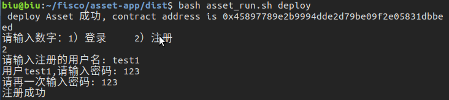

- 随后登录

- 查看初始账户额度

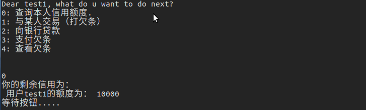

- 向银行贷款2000元，生成欠条号9500

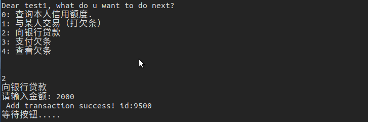

- 查看欠条9500

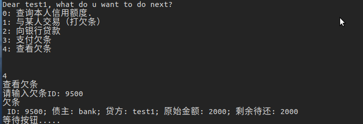

- 查看当前额度应当为10000-2000=8000

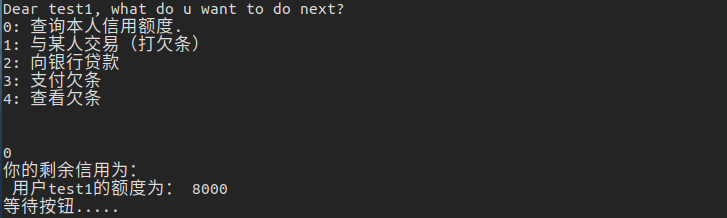

- 向账户biu打欠条8000元，生成欠条号为9501

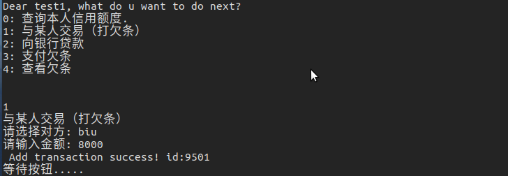

- 查看当前额度应当为0元

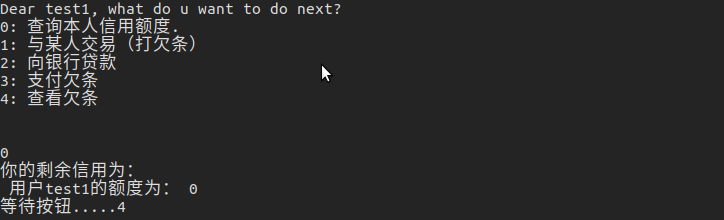

- 查看欠条9501

- 支付欠条9501号，5000元

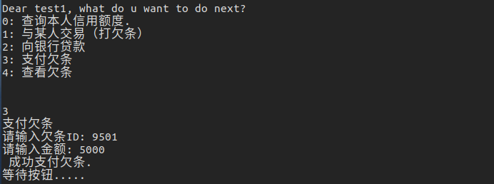

- 查看欠条剩余应当还8000-5000=3000

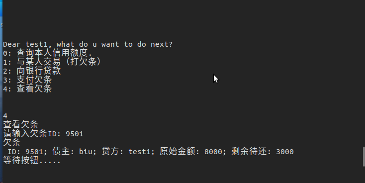

- 再次查看当前余额应当为5000

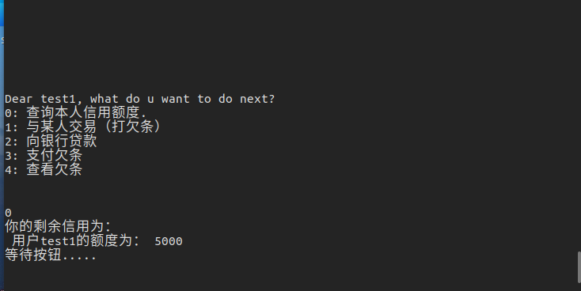

- 本次还欠条9500号，500元

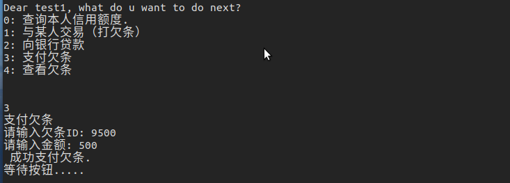

- 还了500后，额度增加500为5500元

