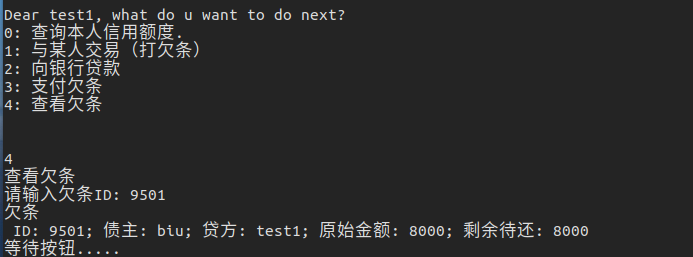
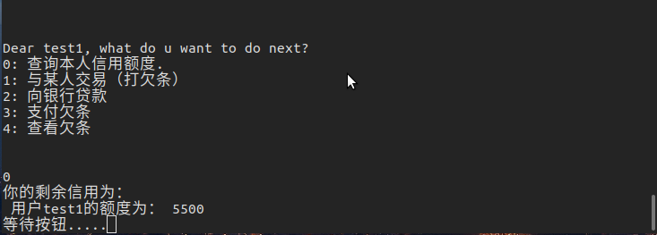

- 首先注册一个账户

- 随后登录

- 查看初始账户额度

- 向银行贷款2000元，生成欠条号9500

- 查看欠条9500

- 查看当前额度应当为10000-2000=8000

- 向账户biu打欠条8000元，生成欠条号为9501

- 查看当前额度应当为0元

- 查看欠条9501

- 支付欠条9501号，5000元

- 查看欠条剩余应当还8000-5000=3000

- 再次查看当前余额应当为5000

- 本次还欠条9500号，500元

- 还了500后，额度增加500为5500元

